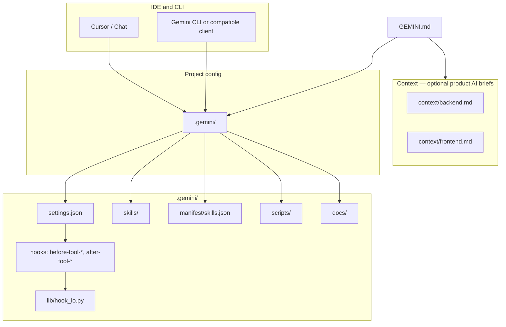

# Architecture: vibe_coding_project

This repository combines:

1. **AI harness (primary in-tree)** — [Cursor](https://cursor.com), [Gemini CLI](https://github.com/google-gemini/gemini-cli) (or similar), hooks, skills, and policy under **`.gemini/`**.
2. **Optional product context** — Backend (FastAPI) and client (Flutter) **guidance** in [`context/`](context/) for when you build that app; it may be ahead of or behind actual `src/` code.

## High-level map

## Directory layout

| Path | Role |
|------|------|
| [GEMINI.md](GEMINI.md) | **Entry** for the model: what this repo is, links to harness, context, and rules. |
| [context/backend.md](context/backend.md) | **Optional** product context for API / Python backend. |
| [context/frontend.md](context/frontend.md) | **Optional** product context for Flutter / client. |
| `.gemini/settings.json` | **Hooks**: `BeforeTool` / `AfterTool` matchers and `python` commands (run with **repo root** as `cwd`). |
| `.gemini/lib/hook_io.py` | Shared **stdin/JSON → stdout/JSON** helpers for hook scripts. |
| `.gemini/hooks/before-tool-block-env.py` | **Before** selected tools: if serialized input references `.env`, **deny**; else **allow**. |
| `.gemini/hooks/after-tool-prettier.py` | **After** `write_file` / `replace`, runs **Prettier** for supported file types (fails open to **allow** on errors). |
| `.gemini/skills/<id>/` | `SKILL.md` (+ optional `evals.py`). Registry: **`.gemini/manifest/skills.json`**. |
| `.gemini/scripts/simulate_best_of_n.py` | Local demo of best-of-N; not the IDE’s `/best-of-n`. |
| `.gemini/scripts/gen_skills_manifest.py` | Regenerates the skills manifest from disk. |
| `.gemini/docs/BEST_OF_N.md` | How to use best-of-n in the IDE; links to the script above. |

## Hook data flow (conceptual)

1. **BeforeTool:** stdin = one JSON object. **before-tool-block-env** uses **`hook_io`**; may respond with `deny` when `.env` is referenced. Do not exfiltrate secrets.
2. **AfterTool:** **after-tool-prettier** resolves `file_path`, runs `npx prettier --write` when applicable, then **allow** (with optional `additionalContext`).

## Invariants

- **cwd** = repository root for hook commands in `settings.json` (`python .gemini/hooks/...`).
- **Skills** list of record: [`.gemini/manifest/skills.json`](.gemini/manifest/skills.json); re-run [gen_skills_manifest.py](.gemini/scripts/gen_skills_manifest.py) when folders change.
- A **`.claude/`** mirror, if you add it for another client, should stay aligned with **`.gemini`**.

## What this doc is not

- It does not replace **runtime** architecture for a deployed app; extend when `src/` or `backend/` is added.
